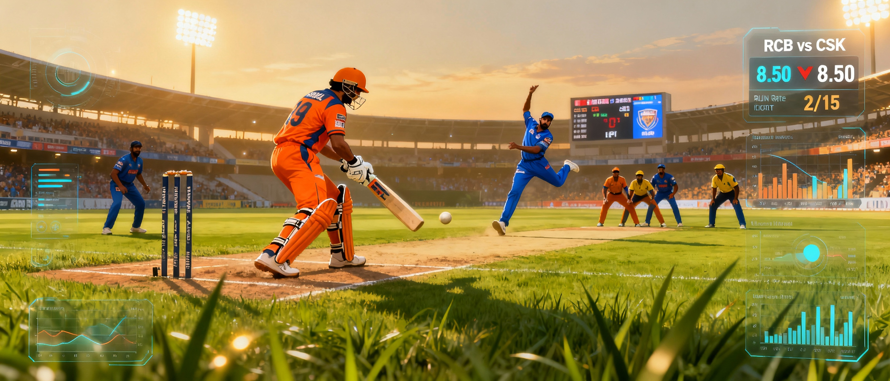
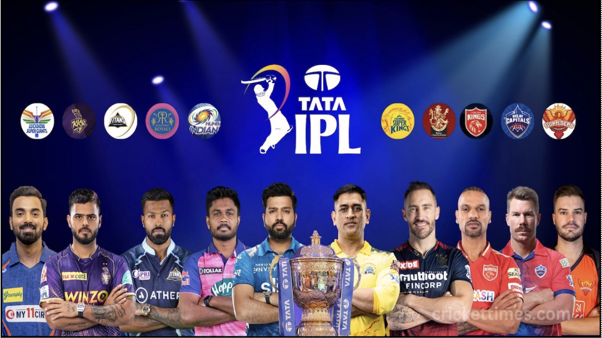
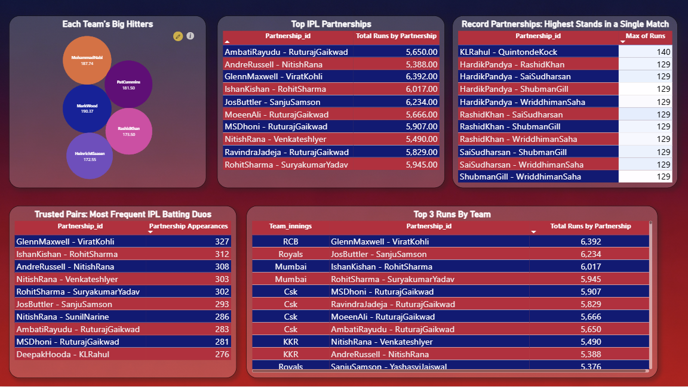

# IPL Analytics Dashboard

A visually immersive Power BI dashboard project to explore IPL (Indian Premier League) cricket data: player records, head-to-head rivalries, team strengths, partnerships, and more.

---

## Table of Contents
1. [Project Overview](#project-overview)
2. [Visual Gallery](#visual-gallery)
3. [Features & Insights](#features--insights)
4. [Data Sources](#data-sources)
5. [How to Use](#how-to-use)
6. [Credits & License](#credits--license)

---

## Project Overview

This dashboard provides interactive analytics and storytelling for IPL, using official match datasets and stats. Navigate each page by visual cues and descriptive sections.

---

## Visual Gallery

### 1. IPL Dashboard Cover & Franchise/Player Intro

Main cover showing **all IPL franchises, team logos, and star players**. Sets up the project theme and welcomes viewers.

---

### 2. Head-to-Head Rivalry Matrix & Close Matches Table

- **Left**: Team-by-team win/loss records, heatmap matrix, and filtered head-to-head analysis.
- **Right**: Table of IPL's closest matches ("Close Encounters") determined by the smallest win/loss margin.

---

### 3. IPL 2024 Squad & Player Composition Analytics

- **Squad size by team** (bar graph)
- **Right/Left-hand batter proportion** (pie chart)
- **Bowling style split** (pace vs spin, bar)
- **Allrounders per team** (bar chart)
- **Bottom**: Detailed player table (team, role, style)

---

### 4. Season Highlights & Historical Trends

- **Batting Leaderboard**: Top run-scorers bar chart
- **Bowling Leaderboard**: Top wicket-takers bar chart
- **Performance Table**: Team-wise trends for 2021-2023 (runs, wickets, wins)
- **KPI Cards**: Highest team score, wickets, individual runs per match

---

### 5. Batting Partnerships & Run Standouts

- **Big Hitters Bubble**: Top boundary/performance players by team
- **Top Partnerships Table**: Most productive duos (by total runs)
- **Record Stands Table**: Highest partnerships in a single match
- **Frequent Duos Table**: Most common pairings
- **Top Partnership By Team Table**: Each team's partnership leaders

---

### 6. Bowling Leaders & Team Analysis

- **Wicket Taker Leaderboard**: Top 10 IPL bowlers
- **Match-Winner Table**: Most four/five-wicket haul bowlers
- **Team Bowling Power Matrix**: Team-wise economy rate, wickets, four-wicket hauls

---

## Features & Insights

- **Fully interactive filtering** (team, player, season, match)
- Covers batting and bowling analytics, franchise comparisons, rivalry stats, key player breakdowns, and close-match drama
- Magazine-style design, color-coded by franchise, easy navigation per section

---

## Data Sources

Data sourced from IPL match records:
- `fact_batting_summary.csv` (batting stats & partnerships)
- `fact_bowling_summary.csv` (bowling stats & hauls)
- `dim_match_summary.csv` (match details & outcomes)
- `dim_players.csv` (optional, player roles/styles)

---

## How to Use

1. Open the Power BI `.pbix` file
2. Locate all visual pages using the page menu/tabs
3. Match page order visually as above for exploration or presentation
4. Use interactive slicers/filters for deeper comparison and customized insights

---

## Credits & License

Dashboard: Saibalaji 
Data: IPL official records & ESPNcricinfo  
Report visuals designed using Power BI

MIT License (customizable)

---

*For demo requests or questions, open an issue or contact via portfolio/email link!*
